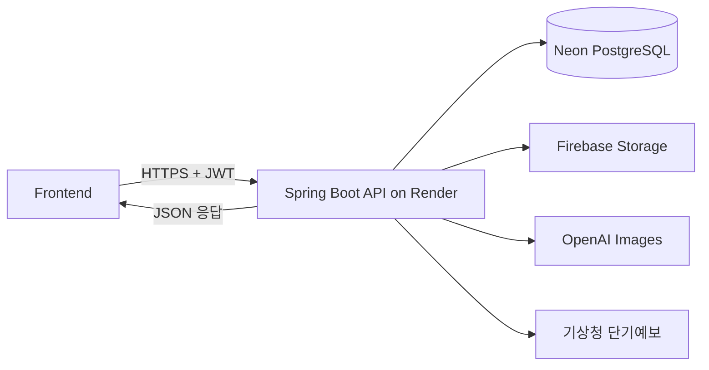

# Codi-AI 시스템 아키텍처

## 전체 흐름



## 구성 요소

### Frontend

- 회원가입과 로그인
- 신체 프로필 및 아바타 설정
- 의류 이미지 업로드와 옷장 관리
- 자연어 일정, 위치, 코디 조건 입력
- 추천 후보, 즐겨찾기, 피드백, 가상 착장 표시

### Backend

- `/api/v1` REST API 제공
- Spring Security와 JWT 기반 사용자 인증
- 사용자 소유 리소스의 조회·수정·삭제 권한 검사
- MyBatis를 통한 PostgreSQL 접근
- Firebase, OpenAI, 기상청 API 연동
- 공통 성공 응답과 오류 응답 제공

### Neon PostgreSQL

계정, 프로필, 의류 메타데이터, 추천 결과, 즐겨찾기, 피드백과 작업 상태를 저장합니다. Flyway가 애플리케이션 시작 시 필요한 스키마를 적용합니다.

### Firebase Storage

의류 원본, 마스크, 아바타, 빠른 미리보기와 고품질 렌더 이미지를 저장합니다. DB에는 파일 자체가 아니라 URL과 관련 메타데이터를 저장합니다.

### 외부 서비스

- 기상청 키가 없거나 호출에 실패하면 계절 기반 기본 날씨를 사용합니다.
- OpenAI 이미지 호출이 불가능하면 빠른 2D SVG 착장 결과로 대체합니다.

## 이미지 처리 흐름

```text
Frontend multipart 업로드
→ Backend MIME/용량 확인
→ Firebase Storage 저장
→ 다운로드 URL을 Neon에 저장
→ API 응답으로 이미지 URL 반환
```

고품질 가상 착장은 저장된 Firebase 이미지를 백엔드가 읽어 OpenAI에 전달하고, 생성 결과를 다시 Firebase에 저장합니다.

## 배포

- 운영 API: Render Docker Web Service
- 운영 DB: Neon Singapore Region
- 이미지 저장소: Firebase Storage
- API 문서: Springdoc OpenAPI와 Swagger UI

운영 상태는 [Swagger UI](https://backend-s092.onrender.com/swagger-ui/index.html)와 [OpenAPI JSON](https://backend-s092.onrender.com/v3/api-docs)에서 확인할 수 있습니다.
