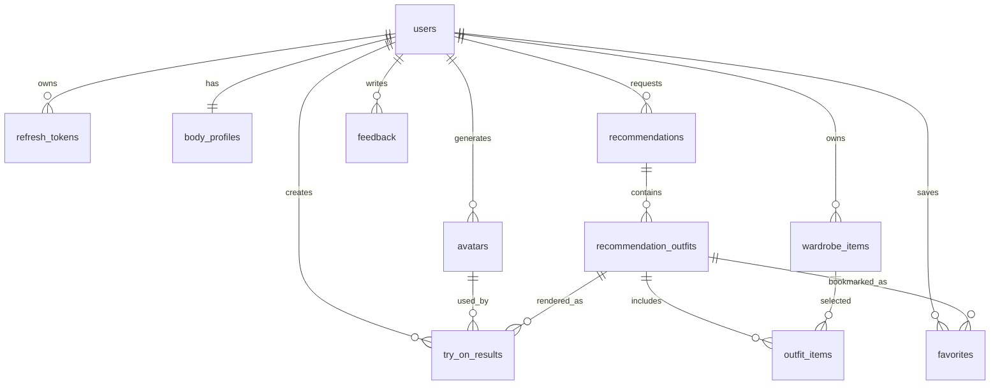

# Codi-AI PostgreSQL 데이터베이스

## 운영 구성

Codi-AI의 서비스 데이터는 Neon PostgreSQL에 저장합니다. Spring Boot는 MyBatis로 SQL을 실행하고 Flyway로 스키마 버전을 관리합니다.

- 운영 DB: Neon PostgreSQL
- 마이그레이션: `Backend/src/main/resources/db/migration`
- 현재 최초 스키마: `V1__init.sql`
- 이미지 원본: Firebase Storage
- DB 이미지 필드: Firebase 다운로드 URL과 객체 메타데이터

Firebase 이미지 자체를 PostgreSQL의 BLOB으로 저장하지 않습니다.

## 테이블

| 테이블 | 역할 | 주요 관계 |
| --- | --- | --- |
| `users` | 계정과 기본 취향 | 최상위 사용자 |
| `refresh_tokens` | Refresh Token 해시와 폐기 상태 | `users` N:1 |
| `body_profiles` | 키, 체형, 성별 표현, 동의 시각 | `users` 1:1 |
| `avatars` | 사용자 아바타와 버전 | `users` N:1 |
| `wardrobe_items` | 의류 속성과 이미지 URL | `users` N:1 |
| `recommendations` | 추천 요청과 날씨 스냅샷 | `users` N:1 |
| `recommendation_outfits` | 추천 후보, 점수와 설명 | `recommendations` N:1 |
| `outfit_items` | 착장과 의류 연결 | Outfit·Wardrobe N:M |
| `try_on_results` | 미리보기·고품질 렌더 상태 | 사용자·아바타·착장 참조 |
| `favorites` | 사용자가 저장한 추천 착장 | 사용자·착장 유일 조합 |
| `feedback` | 추천 및 직접 코디 평가 | 사용자와 추천/착장 참조 |
| `weather_cache` | 격자별 예보 캐시 | 독립 캐시 |

## 핵심 관계



## 데이터 삭제

사용자 하위 테이블은 외래 키의 `ON DELETE CASCADE`를 사용합니다. 회원 탈퇴나 이미지 리소스 삭제 시에는 DB 레코드뿐 아니라 Firebase 객체도 서비스 계층에서 함께 정리해야 합니다.

## 연결 설정

Neon 연결값은 Git에 기록하지 않고 환경변수로 제공합니다.

```properties
SPRING_PROFILES_ACTIVE=neon
DB_URL=jdbc:postgresql://HOST/DB_NAME?sslmode=require
DB_USERNAME=YOUR_DB_USER
DB_PASSWORD=YOUR_DB_PASSWORD
```

Neon이 제공하는 `postgresql://...` 문자열은 Spring JDBC 형식인 `jdbc:postgresql://...`로 사용합니다.
